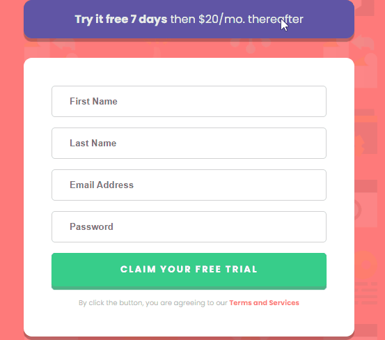

# Intro Component With Signup Form Master

Criei o projeto com os conceitos do `Display: Grid;`

Sei que é mais simples fazer com o `Display:Flex;` mas eu gostaria de exercitar os conceitos do outro formato.

Ainda está faltando fazer a parte do `JS`, mas ainda não aprendi. Mais pra frente completo essa parte.

## Dificuldades
A parte mais complicada, foi na estilização dos `inputs` do formulário, pois ainda não havia feito anteriormente. O `button` foi estilizado para dar um efeito 3D ao clicar. 

Foi também uma parte que tive que aprender para conseguir fazer.

### Conclusão
Fiquei bem satisfeito com o resultado. Com a utilização das `Medias Queries`, apliquei a responsividade para varios tamanhos de tela.

### Feedback
Tão importante quanto a prática do desafio, para aplicação dos conceitos aprendidos, são os `Feedbacks`. Pra mim é muito bem vindo, é uma parte importante para o aprimoramento do aprendizado.

